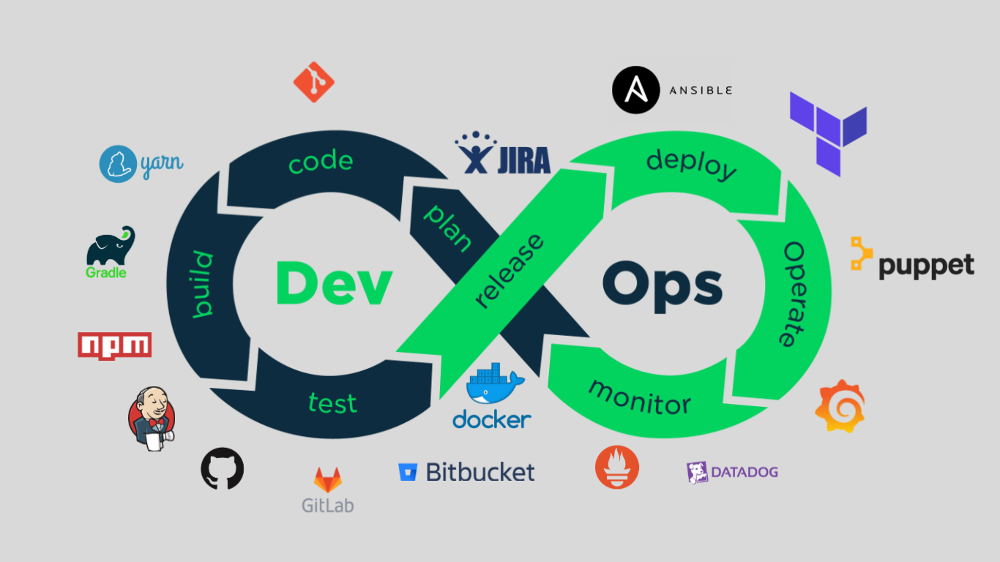

# 🚀 Monitoring a Containerized URL Shortener Webservice  

<p align="center">
  
</p>

<p align="center">
  
  
  
  
</p>

---

## 📌 Objective  
To build, containerize, and monitor a functional **URL Shortener Webservice** with a complete monitoring stack using **Prometheus** and **Grafana**. The entire system runs locally using **Docker & Docker Compose**.  

---

## 📖 Project Description  
This project involves:  
- Developing a **URL shortener service** with API endpoints.  
- Storing mappings in a lightweight **SQLite database**.  
- **Containerizing** the service with Docker.  
- **Instrumenting** the service with custom Prometheus metrics.  
- Visualizing metrics in **Grafana dashboards**.  
- Enabling **alerts & persistence** for production-like stability.  

---

## 🛠️ Tech Stack  
- **Backend Framework**: Flask (Python) or Express (Node.js)  
- **Database**: SQLite  
- **Containerization**: Docker & Docker Compose  
- **Monitoring Tools**: Prometheus & Grafana  

---

## 📅 Roadmap & Deliverables  

### ✅ Week 1: Build & Containerize the URL Shortener  
- Create API endpoints:  
  - `POST /shorten` → accepts a long URL, returns a short code  
  - `GET /<short_code>` → redirects to the original URL  
- Add SQLite for persistence  
- Write Dockerfile & initial docker-compose setup  

**Deliverables:**  
✔ Functional service with shortening & redirection  
✔ Dockerfile & docker-compose for running locally  

---

### ✅ Week 2: Instrumentation with Prometheus  
- Add custom metrics:  
  - Counter → shortened URLs  
  - Counter → redirects  
  - Counter → failed lookups (404)  
  - Histogram → request latency  
- Configure Prometheus to scrape `/metrics`  
- Update docker-compose with Prometheus  

**Deliverables:**  
✔ Webservice exposing `/metrics`  
✔ Prometheus integration  

---

### ✅ Week 3: Grafana Visualization  
- Add Grafana service to docker-compose  
- Configure Prometheus as a data source  
- Build dashboard with:  
  - URL creation/redirect rates  
  - Total shortened links (stat panel)  
  - 95th percentile latency  
  - 404 error rate  

**Deliverables:**  
✔ Grafana dashboard with live monitoring  

---

### ✅ Week 4: Alerts, Persistence & Documentation  
- Configure **Grafana alerts** (high latency, too many 404s, etc.)  
- Add **Docker volumes** for SQLite, Prometheus, Grafana  
- Test stack persistence across restarts  
- Document API & usage in README  

**Deliverables:**  
✔ Stable stack with persistence  
✔ Alerts in Grafana  
✔ Final project documentation  

---

## 👥 Team Members  

| Member | GitHub | Roles & Contributions |
|--------|--------|------------------------|
| **Alialdeen Muhammad Mostafa** | [Alialdin99](https://github.com/Alialdin99) | Week 1 → Service development, API endpoints, Dockerfile |
| **Azza Mohamed** | [azza12345](https://github.com/azza12345) | Week 1 → Database setup, Docker Compose |
| **Mohamed Nasser Hassan** | [Nassermo2004](https://github.com/Nassermo2004) | Week 2 → Prometheus integration, custom metrics |
| **Ahmed Abdelnabi Abdelrasol** | [Nerosegnofic](https://github.com/Nerosegnofic) | Week 2 → Prometheus config, docker-compose orchestration |
| **Mohamed Ayman Farouk** | [mohamed-mansy](https://github.com/mohamed-mansy) | Week 3 & 4 → Grafana dashboards, alerts, persistence setup |

---

## 📌 API Endpoints  
- `POST /shorten` → Shortens a given URL.  
- `GET /<short_code>` → Redirects to the original URL.  
- `GET /metrics` → Exposes Prometheus metrics.  

---

## 📊 Example Dashboard (Grafana)  

<p align="center">
  
</p>

---

## 🚀 How to Run  
```bash
# Clone repository
git clone <repo-link>
cd project-directory

# Build & start services
docker-compose up --build

---

## 🔗 Google Drive Link
https://drive.google.com/file/d/1sdNowjaMWqecmC5XAPffZE2TZkewlX_m/view?usp=sharing
